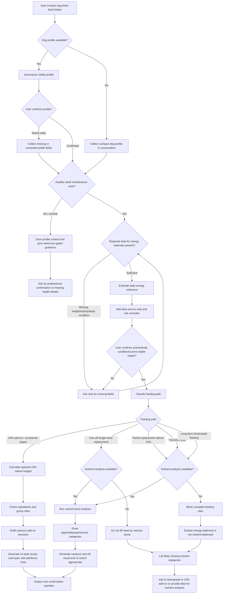
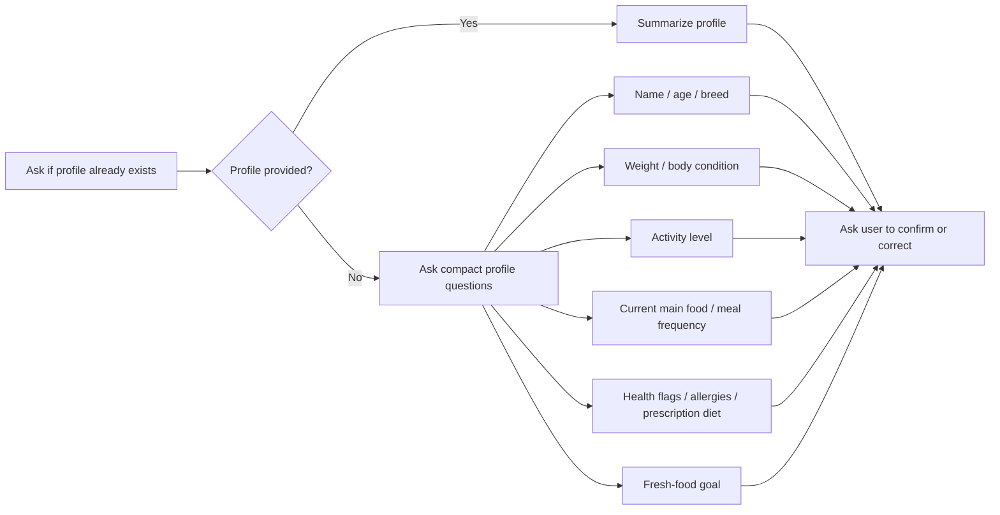
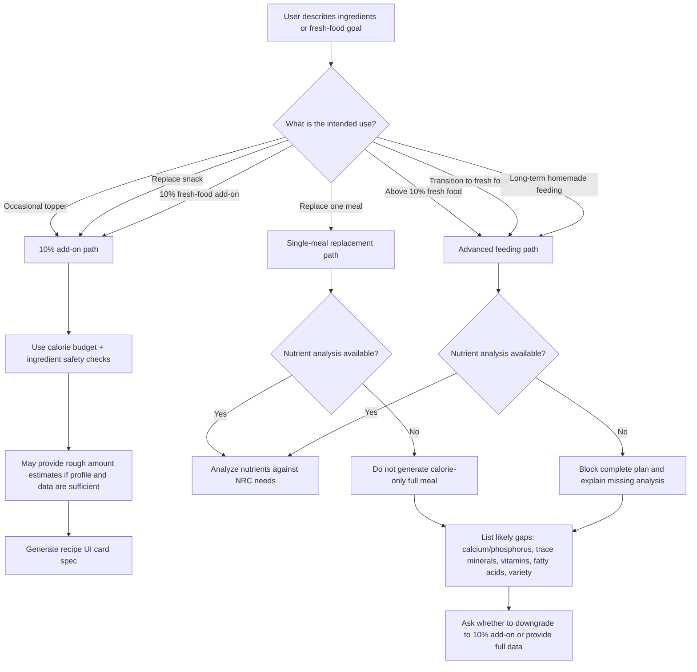
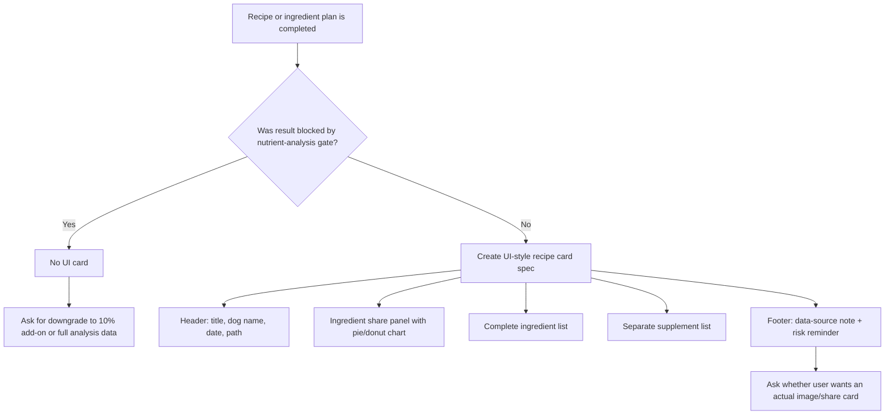

# User Behavior Map

This document maps the expected user flow for `dog-fresh-food-helper`.

The skill is designed to help users move from “I want to cook something fresh for my dog” to a cautious, structured result. It must distinguish simple 10% add-ons from meal replacement or long-term homemade feeding, and it must not turn calorie matching into a claim of nutritional completeness.

## Core Flow

## First-Use Intake

## Path Gate

## Output Decision Table

| User intent | Allowed output | Must not do |
| --- | --- | --- |
| Create dog profile | Ask compact questions, summarize known and unknown fields | Invent unknown profile data |
| Estimate daily intake | Provide NRC-style adult maintenance energy reference if healthy adult data is sufficient | Present energy estimate as a complete diet prescription |
| 10% add-on | Calculate calorie budget, check safety, group ingredients, provide rough plan and UI card | Say the meal is complete, balanced, or NRC-compliant |
| One-off meal replacement | Estimate calories and give cautious one-time structure only if boundaries are clear | Turn a few ingredients into a repeatable balanced template |
| Above 10% / transition / long-term homemade | Require nutrient-level analysis or block complete plan | Generate a recipe from calories alone |
| Nutrient analysis unavailable | List likely missing categories and ask for next step | Pretend the meal is nutritionally adequate |
| Recipe completed | Include data-source note, risk reminder, and UI-style recipe card with pie/donut chart | Force a phone-screen format or call the chart a scientific nutrition ratio |

## Final Recipe Card Flow

## Key Guardrails

- Ask for or confirm a dog profile before giving concrete food suggestions.
- Gate puppies, pregnancy/lactation, illness, prescription diets, allergies, gastrointestinal symptoms, obesity treatment, or unclear health status.
- Treat NRC-style daily intake as an energy estimate only.
- Keep 10% as a calorie budget, not a food-weight rule.
- Treat energy balance and nutrient balance as separate concepts.
- Require nutrient-level analysis for single-meal replacement if it is meant to be repeated, for above-10% fresh food, for transition plans, and for long-term homemade feeding.
- Include data-source notes and risk reminders whenever calculations or concrete plans appear.
- Use the UI card as an information summary, not as proof that the recipe is complete.
